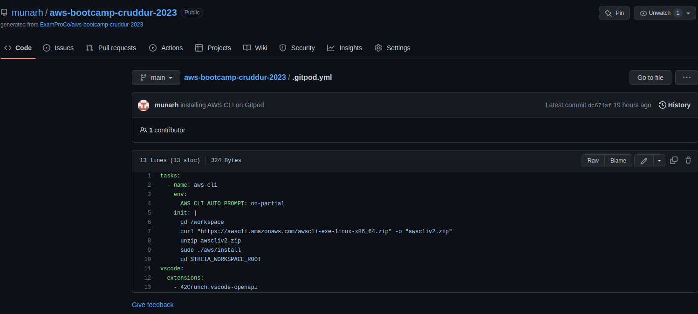
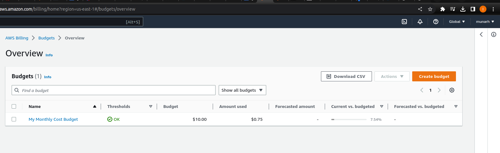
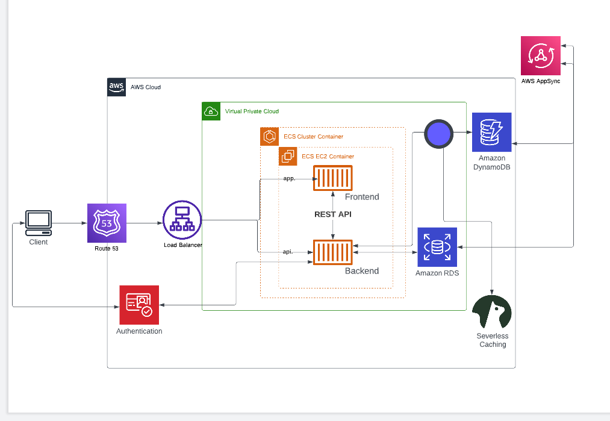
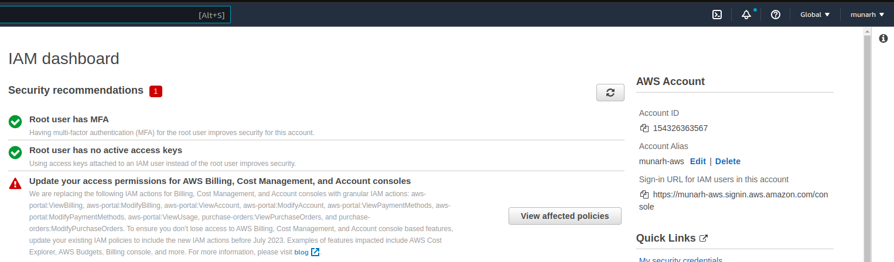

# Week 0 — Billing and Architecture

## Required Homework

### Install AWS CLI

I installed AWS CLI on Gitpod following through the instructions given.

### Create a budget
I didn't need to create a budget because i had a one created a while back and it's set to a monthly budget on $10(Ten dollars)

### Recreate Logical Architectural Design

[Lucid charts share link](https://lucid.app/lucidchart/8b5e0999-7e50-445b-9922-62e7210e2ce2/edit?viewport_loc=-452%2C-83%2C2920%2C1546%2C0_0&invitationId=inv_9586b8b2-7150-49e2-beac-b64f4ae2d30e)

### Homework challenges
 I deactivated and deleted my root account credentials prior to best practices to improve security of my account and I activated MFA on my Account.
 
 
