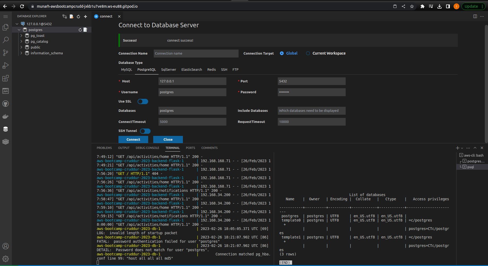

# Week 1 — App Containerization

## Containerize Application (Dockerfiles, Docker Compose)


### containerize Backend 

### Run Python
I ran python in the backend-flask directory with `python3 -m flask run --host=0.0.0.0 --port=4567`
I opened the link 4567 on my browser and appended my url to `api/activities/home` which got me back json

### verification Image


### Add DockerFile

I went on to add a DockerFile containing all the necessary dependencies and configuration for my application in the backend-flask directory

### Build Container
I built the container using `docker build -t  backend-flask ./backend-flask`

### Run Container
I ran the container using `docker run --rm -p 4567:4567 -it -e FRONTEND_URL='*' -e BACKEND_URL='*' backend-flask`

## Containerize Frontend

### Run NPM Install

```
cd frontend-react-js
npm i
```
### Create DockerFile
I created a docker file in the frontend-react-js directory

### Build Container
I built the container with `docker build -t frontend-react-js ./frontend-react-js`

### Run Container
I ran the container with `docker run -p 3000:3000 -d frontend-react-js`

### Verification image


## Create a Docker Compose File
I created a Docker Compose File (`docker-compose.yml`) at the root of my project
This file defines services each of the containers and how they shoul communicate to each other  

## Document the Notification Endpoint for the OpenAI Document

### Verification Image


## Write a Flask Backend Endpoint for Notifications

### Verification image


## Write a React Page for Notifications

### Verification image


## Run DynamoDB Local Container and ensure it works

### Verification image


## Run Postgres Container and ensure it works

### Verification image



