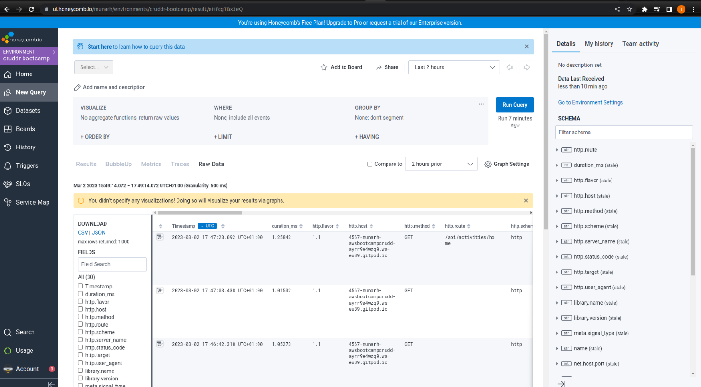
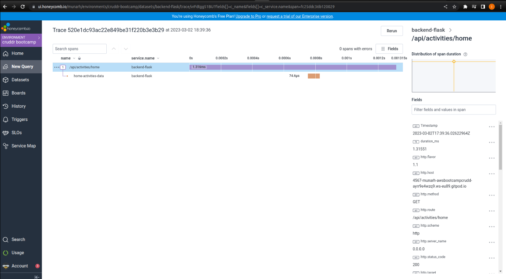
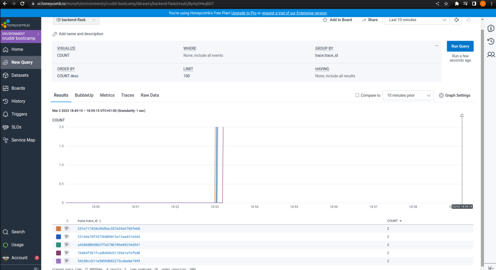
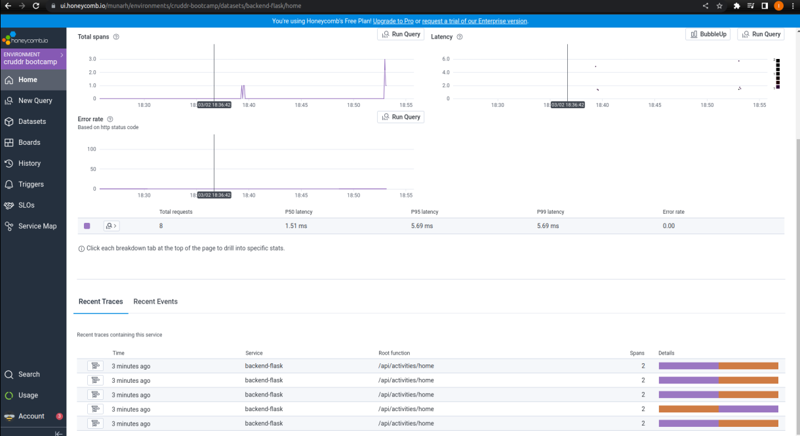
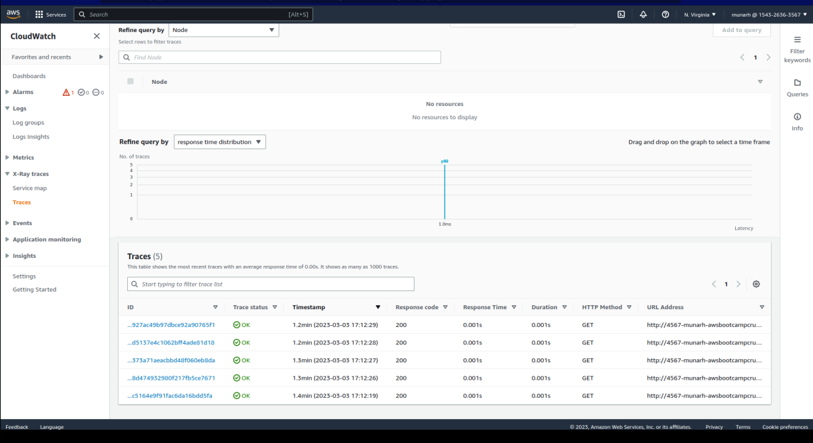
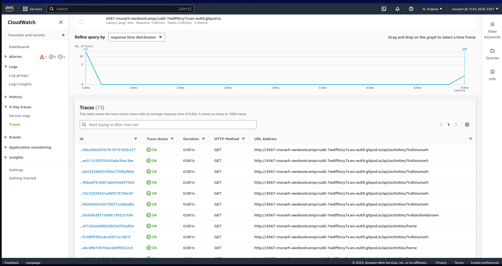
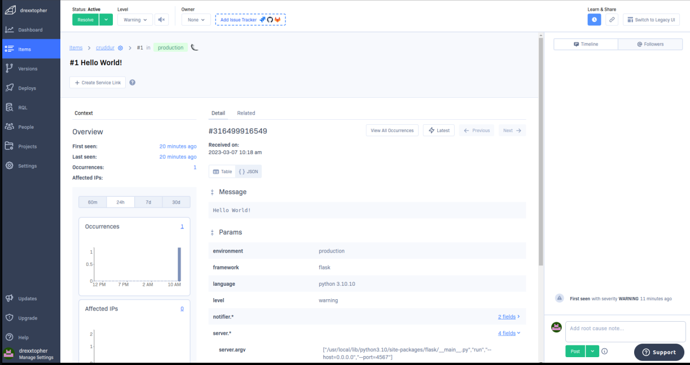

# Week 2 — Distributed Tracing

# Week 2 — Distributed Tracing

## Instrument our backend flask application to use Open Telemetry (OTEL) with Honeycomb.io as the provider
- Instrumented - Backend 
 
Connecting to the Honeycomb was just fixed by `exporting` the `key`

Proof of the Instrumentation with Honeycomb 
## Verification Image

Adding span for the Mock-data in Honeycomb for the Home Page activities 
## Verification Image

## Run queries to explore traces within Honeycomb.io

Running various querries was done using the reference from https://docs.honeycomb.io/getting-data-in/opentelemetry/python/ to `acquiring the Tracer` and for `Query to trace` 

## Verification Image
### ISOFormat Query

### Adding Span for Result Length 

## Instrument AWS X-Ray into backend flask application

- Setup X-Ray Traces 

## Verification Image

## X-Ray Instrumented

## Verification Image

## Add X-Ray sub-segment

## Cloudwatch Instrumented
## Verification Image

## Integrate Rollbar for Error Logging

## Verification Image

